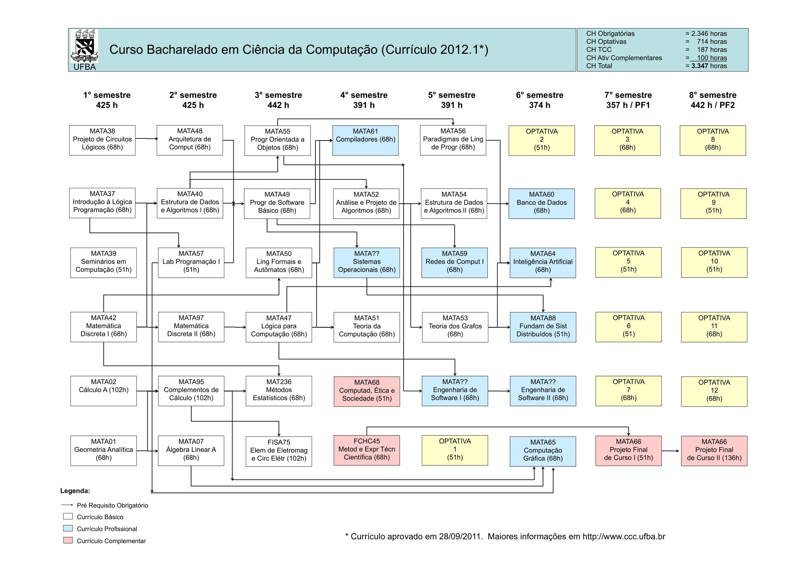

# Matérias Cursadas

### Lucas dos Santos Lima 

Bacharelado em **Ciência da Computação** . 

---
### Grade Curricular

---

|Legenda|Status|
|-----|------|
|:heavy_check_mark: |Completo|
|:heavy_plus_sign: | Em Curso|
|:heavy_minus_sign: |Não Iniciado|

### Situação

|Semestre| | | | | | |
|-|-|-|-|-|-|-|
|1|[Projeto de Circuitos Lógicos](./Computa%C3%A7%C3%A3o/MATA38%20-%20Projeto%20de%20Circuitos%20L%C3%B3gicos/)  :heavy_check_mark:|[Introdução à Lógica de Programação](./Computa%C3%A7%C3%A3o/MATA37%20-%20Introdu%C3%A7%C3%A3o%20a%20L%C3%B3gica%20de%20Programa%C3%A7%C3%A3o/)  :heavy_check_mark:|Seminário de Introdução ao Curso  :heavy_check_mark:|Matemática Discreta I  :heavy_check_mark:| Cálculo A  :heavy_check_mark:|Geometria Analítica  :heavy_check_mark:
|2|[Arquitetura de Computadores](./Computa%C3%A7%C3%A3o//MATA48%20-%20Arquitetura%20de%20Computadores/)  :heavy_check_mark:|Estrutura de Dados e Algoritmos I  :heavy_check_mark:|[Laboratório de Programação I](./Computa%C3%A7%C3%A3o/MATA57%20-%20Laborat%C3%B3rio%20de%20Programa%C3%A7%C3%A3o/)  :heavy_check_mark:|Matemática Discreta II  :heavy_minus_sign:|Complementos de Cálculo  :heavy_check_mark:|Algebra Linear A  :heavy_minus_sign:|
|3|[Programação Orientada a Objetos](./Computa%C3%A7%C3%A3o/MATA55%20-%20Programacao%20Orientada%20a%20Objetos/)  :heavy_minus_sign:|Programação de Software Básico  :heavy_plus_sign:|Linguagens Formais e Autômatos  :heavy_minus_sign:|Lógica para Computação :heavy_minus_sign:|[Métodos Estatísticos](./Outras//MAT236%20-%20M%C3%A9todos%20Estat%C3%ADsticos/)  :heavy_plus_sign:|Elementos de Eletromagnetismo  :heavy_minus_sign:
|4|[Metodologia E Expressão Técnico-científica](./Outras/FCHC45%20-%20Metodologia%20e%20Express%C3%A3o%20T%C3%A9cnico%20Cient%C3%ADfica/) :heavy_plus_sign:|Teoria Da Computação :heavy_minus_sign:|[Análise E Projeto De Algoritmos](./Computa%C3%A7%C3%A3o/MATA52%20-%20An%C3%A1lise%20e%20Projeto%20Algoritmos/) :heavy_minus_sign:|Sistemas Operacionais :heavy_minus_sign:|Compiladores :heavy_minus_sign:|Computador, ética e sociedade :heavy_minus_sign:|
|5|Teoria dos Grafos  :heavy_minus_sign:|Estrutura de Dados e Algoritmos II  :heavy_minus_sign:|Redes de Computadores I  :heavy_minus_sign:|Engenharia de Software I :heavy_minus_sign:|Paradigmas de Linguagem de Programação  :heavy_minus_sign:|Optativa 1  :heavy_minus_sign:|
|6|Banco de Dados  :heavy_minus_sign:|Inteligência Artificial  :heavy_minus_sign:|Computação Gráfica  :heavy_minus_sign:|Fundamentos de Sistemas Distribuídos  :heavy_minus_sign:|Engenharia de Software II  :heavy_minus_sign:|Optativa 2  :heavy_minus_sign:|
|7|Projeto Final de Curso I  :heavy_minus_sign:| Optativa 3:  :heavy_minus_sign:| Optativa 4  :heavy_minus_sign:| Optativa 5  :heavy_minus_sign:| Optativa 6  :heavy_minus_sign:| Optativa 7 :heavy_minus_sign:|
|8|Projeto Final de Curso II  :heavy_minus_sign:|Optativa 8  :heavy_minus_sign:| Optativa 9  :heavy_minus_sign:| Optativa 10  :heavy_minus_sign:| Optativa 11  :heavy_minus_sign:| Optativa 12  :heavy_minus_sign:|