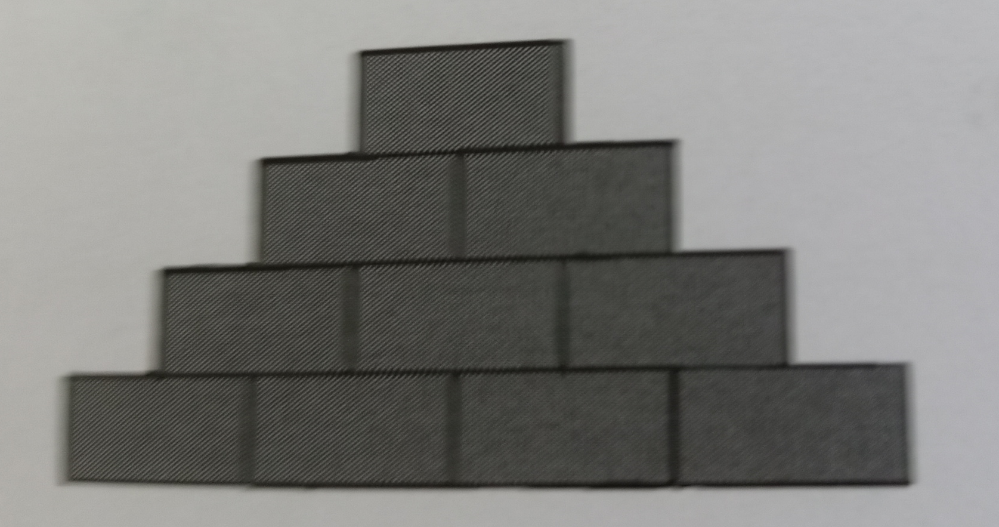

<h1>Sub Rotinas Recursivas</h1>
<h2> <a href="https://github.com/LucasDSL/Faculdade/blob/67aa07aa8e987120754d7dea32e1f5a049c73ced/02%20Laborat%C3%B3rio%20de%20Programa%C3%A7%C3%A3o%20I/07%20Sub-Rotinas%20Recursivas/e12.c">Exercício 12</a>:</h2> 

Crie uma função recursiva que receba um número inteiro n como parâmetro e retorne o soma dos números de 1 a n.

<h2><a href="https://github.com/LucasDSL/Faculdade/blob/67aa07aa8e987120754d7dea32e1f5a049c73ced/02%20Laborat%C3%B3rio%20de%20Programa%C3%A7%C3%A3o%20I/07%20Sub-Rotinas%20Recursivas/e13.c">Exercício 13</a>:</h2> 

Crie uma função recursiva que receba dois números inteiros n e m como parâmetro e retorne o soma dos números do intervalo [n, m].

<h2><a href="https://github.com/LucasDSL/Faculdade/blob/67aa07aa8e987120754d7dea32e1f5a049c73ced/02%20Laborat%C3%B3rio%20de%20Programa%C3%A7%C3%A3o%20I/07%20Sub-Rotinas%20Recursivas/e14.c">Exercício 14</a>:</h2> 

[adaptado de Paes (2016)]. Crie uma função recursiva que encontre o fatorial de um número. Lembre que: fatorial(0) = 1; fatorial(n) = n * fatorial(n -1), para n > 0.

<h2><a href="https://github.com/LucasDSL/Faculdade/blob/67aa07aa8e987120754d7dea32e1f5a049c73ced/02%20Laborat%C3%B3rio%20de%20Programa%C3%A7%C3%A3o%20I/07%20Sub-Rotinas%20Recursivas/e15.c">Exercício 15</a>:</h2> 

[adaptado de Paes (2016)]. Crie uma função para calcular, de forma recursiva, a soma dos elementos de um vetor. A função deve ter a seguinte assinatura: 
int soma(int * vetor, int i, int tam)

<h2><a href="https://github.com/LucasDSL/Faculdade/blob/67aa07aa8e987120754d7dea32e1f5a049c73ced/02%20Laborat%C3%B3rio%20de%20Programa%C3%A7%C3%A3o%20I/07%20Sub-Rotinas%20Recursivas/e16.c">Exercício 16</a>:</h2> 

[adaptado de Paes (2016)]. Faça uma função recursiva que encontre um determinado número em um vetor e retorne o índice de onde ele foi encontrado. A função deve ter a seguinte assinatura:  
int procurar(int * vetor, int tam, int indice, int num)

<h2><a href="https://github.com/LucasDSL/Faculdade/blob/67aa07aa8e987120754d7dea32e1f5a049c73ced/02%20Laborat%C3%B3rio%20de%20Programa%C3%A7%C3%A3o%20I/07%20Sub-Rotinas%20Recursivas/e17.c">Exercício 17</a>:</h2>  

[adaptado de Paes (2016)]. Faça uma função recursiva que receba um vetor como parâmetro e retorne o seu maior elemento. A função deve ter a seguinte assinatura: 
int maior(int * vetor, int tam, int indice)

<h2><a href="https://github.com/LucasDSL/Faculdade/blob/67aa07aa8e987120754d7dea32e1f5a049c73ced/02%20Laborat%C3%B3rio%20de%20Programa%C3%A7%C3%A3o%20I/07%20Sub-Rotinas%20Recursivas/e18.c">Exercício 18</a>:</h2>

[adaptado de Paes (2016)]. Escreva uma função recursiva que receba dois números reais e retorne a multiplicação entre eles. Não utilize o operador de multiplicação nem repetições.

<h2><a href="https://github.com/LucasDSL/Faculdade/blob/3744951c355de62769c13e7fdd9092a5d5633883/02%20Laborat%C3%B3rio%20de%20Programa%C3%A7%C3%A3o%20I/07%20Sub-Rotinas%20Recursivas/e19.c">Exercício 19</a>:</h2>  

[adaptado de Paes (2016)]. Escreva uma função recursiva que receba uma string e o tamanho dessa string como parâmetro e retorne a mesma string com os caracteres na ordem contrária. Nesse caso, o retorno deve ser realizado alternado a própria string recebida com parâmetro: 
void inverter(char * s, int pos, int len)

<h2><a href="https://github.com/LucasDSL/Faculdade/blob/67aa07aa8e987120754d7dea32e1f5a049c73ced/02%20Laborat%C3%B3rio%20de%20Programa%C3%A7%C3%A3o%20I/07%20Sub-Rotinas%20Recursivas/e20.c">Exercício 20</a>:</h2>

Escreva uma função recursiva que dois número inteiros como parâmetro e retorne o máximo divisor comun entre eles (MDC).

<h2><a href="https://github.com/LucasDSL/Faculdade/blob/e25dab5e35e8e7bc1bd5db7c805380d0e8769d80/02%20Laborat%C3%B3rio%20de%20Programa%C3%A7%C3%A3o%20I/07%20Sub-Rotinas%20Recursivas/e21.c">Exercício 21</a>:</h2>

[Paes (2016)]. Os faraós da terra do nunca resolveram fazer uma pirâmide empilhando blocos de barro. No topo da pirâmide existe apenas um bloco. Embaixo desse, existem dois blocos; embaixo desses dois blocos, existem três blocos e assim sucessivamente, até a base da pirâmide. A Figura abaixo representa um exemplo de pirâmide de base 4.

Escreva uma função recursiva que, dada a quantidade de blocos existentes na base, retorne o total de blocos da pirâmide. Não use multiplicações nem repetições para resolver esse exercício.

<h2><a href="https://github.com/LucasDSL/Faculdade/blob/e25dab5e35e8e7bc1bd5db7c805380d0e8769d80/02%20Laborat%C3%B3rio%20de%20Programa%C3%A7%C3%A3o%20I/07%20Sub-Rotinas%20Recursivas/e22.c">Exercício 22</a>:</h2>

[Deitel e Deitel (2016)]. Neste exercício, os estudantes deverão observar a recursão em ação. Modifique a função recursiva para o calculo de fatorial, construída anteriormente, para que a mesma imprima suas variáveis locais a cada chamada recursiva. Para cada chamada recursiva, a saída é apresentada na tela em uma linha separada e com um nível de indentação. Faça o máximo para tornar a saída na tela mais legível, interessante e significativa possível.  Seu objetivo é projetar e implementar uma formatação que ajude a entender melhor a recursão.

<h2><a href="https://github.com/LucasDSL/Faculdade/blob/e25dab5e35e8e7bc1bd5db7c805380d0e8769d80/02%20Laborat%C3%B3rio%20de%20Programa%C3%A7%C3%A3o%20I/07%20Sub-Rotinas%20Recursivas/e23.c">Exercício 23</a>:</h2>

[adaptado de Deitel e Deitel (2016)]. Em C/C++, é possível fazer chamadas recursivas para a função "main"? Escreva um programa contendo uma função main recursiva. Inclua uma variável local "cont" inicializada com 1. Incremente e imprima o valor de cont a cada chamada de main. Execute o programa e descreva o que acontece.

<h2><a href="https://github.com/LucasDSL/Faculdade/blob/e25dab5e35e8e7bc1bd5db7c805380d0e8769d80/02%20Laborat%C3%B3rio%20de%20Programa%C3%A7%C3%A3o%20I/07%20Sub-Rotinas%20Recursivas/e24.c">Exercício 24</a>:</h2>

[adaptado de Deitel e Deitel (2016)]. O algoritmo recursivo usado para calcular os números de Fibonacci tem um apelo intuitivo. Entretanto, o algoritmo resulta em uma explosão de chamadas recursivas. Implemente uma versão interativa da função de Fibonacci e, então, compare as implementações recursivas e interativas. Discuta as vantagens e desvantagens de cada uma dessas implementações.

